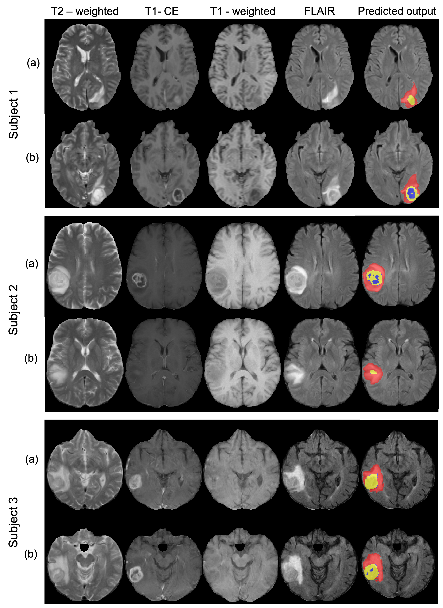
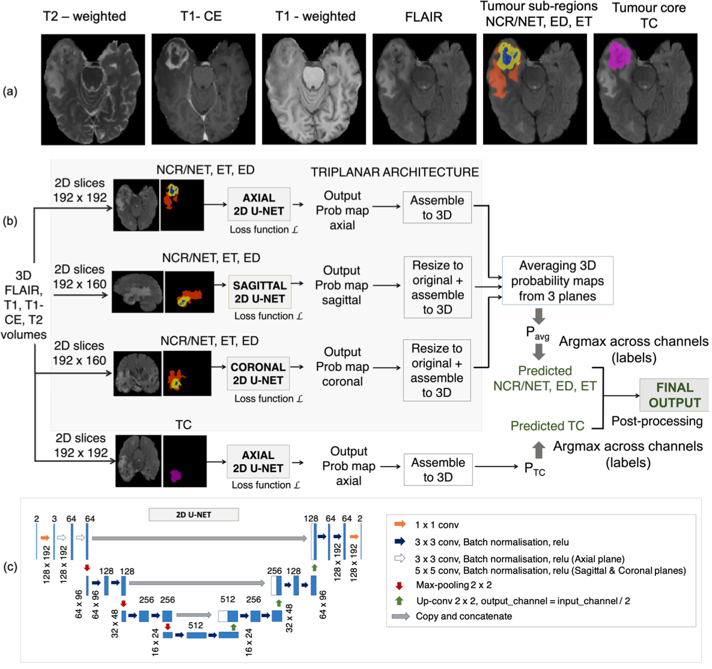
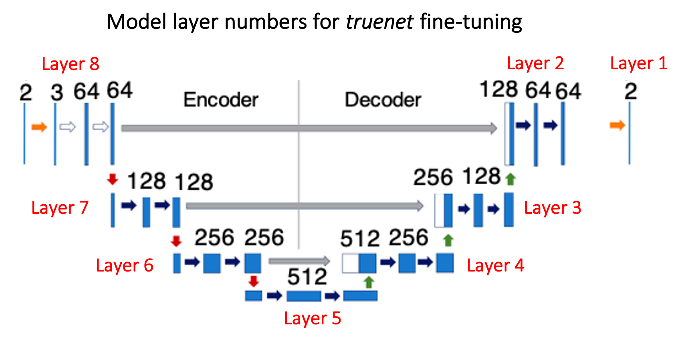

# Top 10 DL tool for MICCAI Brain Tumour Segmentation Challenge 2020
## Brain Tumour Segmentation with TrUE-Net tool

## Preprint (to be updated)

#### Software versions used for truenet:
- Python > 3.6
- PyTorch=1.5.0

#### Dependencies for prepare_truenet_data:
- FMRIB software library (FSL) 6.0

## TrUE-Net tumour segmentation results:


## TrUE-Net tumour segmentation architecture:


### Classes and the loss function:
For each subject, the given input modalities include FLAIR, T1-weighted (T1), post-contrast T1-weighted (T1-CE) and T2-weighted (T2) images.  The manual segmentations for the training dataset consists of 3 labels: necrotic core/non-enhancing tumour (NCR/NET), edematous tissue or peritumoral edema (ED) and enhancing tumour (ET). We used a sum of the voxel-wise cross-entropy loss function and the Dice loss as the total cost function. 

## To install the truenet tool
Clone the git repository into your loacal directory and run:
``` 
python setup.py install
```
To find about the subcommands available in truenet:
```
truenet_tumseg --help
```
And for options and inputs for each sub-command, type:
```
truenet_tumseg <subcommand> --help (e.g. truenet train --help)
```
## Preprocessing and preparing data for truenet
We used FLAIR, T1, T1 CE and T2 as inputs for the model. We reoriented the images to the standard MNI space, performed skull-stripping FSL BET and registered the T1-weighted image to the FLAIR using linear rigid-body registration.

## prepare_tumseg_data
```
Usage: prepare_tumseg_data <Base_modality_type> <output_basename> <FLAIR_image_name> <T1_image_name> <T1ce_image_name> <T2_image_name>
 
The script applies the preprocessing pipeline on FLAIR, T1, T1ce and T2 to be used in FSL truenet_tumseg with a specified output basename
Base_modality_name and output_basename are mandatory inputs
Remaining inputs are optional, image corresponding to Base_modality_name must be provided. Images to be provided in the given order.
In case you do not have a modality, provide 'None' for that modality.
Base_modality_name = 	name of the modality that the rest will be registered to (preferable ~1mm iso); valid options: flair, t1, t1ce, t2
output_basename = 	name to be used for the processed images (use absolute path); output_basename_FLAIR.nii.gz, output_basename_T1.nii.gz .... will be saved
FLAIR_image_name = 	name of the input unprocessed FLAIR image
T1_image_name = 	name of the input unprocessed T1 image
T1ce_image_name = 	name of the input unprocessed T1-contrast enhanced image
T2_image_name = 	name of the input unprocessed T2 image

For example, if you have flair, t1 and t2 and want to register everything to t1, use the following command
prepare_tumseg_data t1 path/to/outputbasename path/to/input_flair.nii.gz path/to/input_t1.nii.gz None path/to/input_t2.nii.gz 
```

## Running truenet brain tumor segmentation

Triplanar ensemble U-Net model, v1.0.1

```  
Subcommands available:
    - truenet_tumseg train         Training a TrUE-Net model from scratch
    - truenet_tumseg evaluate      Applying a saved/pretrained TrUE-Net model for testing
    - truenet_tumseg fine_tune     Fine-tuning a saved/pretrained TrUE-Net model from scratch
    - truenet_tumseg cross_validate  Leave-one-out validation of TrUE-Net model
```

### Training the TrUE-Net brain tumor segmentation model

#### truenet train: training the TrUE-Net brain tumor segmentation model from scratch, v1.0.1

```
Usage: truenet_tumseg train -i <input_directory> -l <label_directory> -m <model_directory> [options] 


Compulsory arguments:
       -i, --inp_dir                 Path to the directory containing FLAIR and T1 images for training 
       -l, --label_dir               Path to the directory containing manual labels for training 
       -m, --model_dir               Path to the directory where the training model or weights need to be saved 
   
Optional arguments:
       -modality, --select_modality  Input modalities available to train; format={FLAIR, T1, T1ce, T2, Others} (default=1 1 1 1 0)
       -tr_prop, --train_prop        Proportion of data used for training [0, 1]. The rest will be used for validation [default = 0.8]
       -bfactor, --batch_factor      Number of subjects to be considered for each mini-epoch [default = 10]
       -loss, --loss_function        Applying spatial weights to loss function. Options: weighted, nweighted [default=weighted]
       -gdir, --gmdist_dir           Directory containing GM distance map images. Required if -loss=weighted [default = None]
       -vdir, --ventdist_dir         Directory containing ventricle distance map images. Required if -loss=weighted [default = None]
       -nclass, --num_classes        Number of classes to consider in the target labels (nclass=2 will consider only 0 and 1 in labels;
                                     any additional class will be considered part of background class [default = 2]
       -plane, --acq_plane           The plane in which the model needs to be trained. Options: axial, sagittal, coronal, all [default = all]
       -da, --data_augmentation      Applying data augmentation [default = True]
       -af, --aug_factor             Data inflation factor for augmentation [default = 2]
       -sv_resume, --save_resume_training    Whether to save and resume training in case of interruptions (default-False)
       -ilr, --init_learng_rate      Initial LR to use in scheduler [0, 0.1] [default=0.001]
       -lrm, --lr_sch_mlstone        Milestones for LR scheduler (e.g. -lrm 5 10 - to reduce LR at 5th and 10th epochs) [default = 10]
       -gamma, --lr_sch_gamma        Factor by which the LR needs to be reduced in the LR scheduler [default = 0.1]
       -opt, --optimizer             Optimizer used for training. Options:adam, sgd [default = adam]
       -eps, --epsilon               Epsilon for adam optimiser (default=1e-4)
       -mom, --momentum              Momentum for sgd optimiser (default=0.9)
       -bs, --batch_size             Batch size used for training [default = 8]
       -ep, --num_epochs             Number of epochs for training [default = 60]
       -es, --early_stop_val         Number of epochs to wait for progress (early stopping) [default = 20]
       -sv_mod, --save_full_model    Saving the whole model instead of weights alone [default = False]
       -cv_type, --cp_save_type      Checkpoint to be saved. Options: best, last, everyN [default = last]
       -cp_n, --cp_everyn_N          If -cv_type=everyN, the N value [default = 10]
       -v, --verbose                 Display debug messages [default = False]
       -h, --help.                   Print help message
```

### Testing the TrUE-Net brain tumor segmentation model

#### truenet evaluate: evaluating the TrUE-Net brain tumor segmentation model, v1.0.1

```
Usage: truenet_tumseg evaluate -i <input_directory> -m <model_directory> -o <output_directory> [options]
   
Compulsory arguments:
       -i, --inp_dir                         Path to the directory containing FLAIR and T1 images for testing
       -m, --model_name                      Model basename with absolute path (will not be considered if optional argument -p=True)                                                                  
       -o, --output_dir                      Path to the directory for saving output predictions
   
Optional arguments:
       -modality, --select_modality          Input modalities available to train; format={FLAIR, T1, T1ce, T2, Others} (default=1 1 1 1 0)
       -p, --pretrained_model                Whether to use a pre-trained model, if selected True, -m (compulsory argument will not be onsidered) [default = False]. The model was pretrained on MICCAI BraTS 2020 Training dataset on 4 modalities: FLAIR, T1, T1ce, T2.
       -nclass, --num_classes                Number of classes in the labels used for training the model (for both pretrained models, -nclass=2) default = 2]
       -post, --postprocessing               Whether to perform post-processing for TC region (default=True)
       -int, --intermediate                  Saving intermediate prediction results (individual planes) for each subject [default = False]
       -cv_type, --cp_load_type              Checkpoint to be loaded. Options: best, last, everyN [default = last]
       -cp_n, --cp_everyn_N                  If -cv_type = everyN, the N value [default = 10]
       -v, --verbose                         Display debug messages [default = False]
       -h, --help.                           Print help message
```

### Fine-tuning the TrUE-Net brain tumor segmentation model

#### truenet fine_tune: training the TrUE-Net brain tumor segmentation model from scratch, v1.0.1
<p align="center">
       
</p>

```
Usage: truenet_tumseg fine_tune -i <input_directory> -l <label_directory> -m <model_directory> -o <output_directory> [options]

Compulsory arguments:
       -i, --inp_dir                         Path to the directory containing FLAIR and T1 images for fine-tuning
       -l, --label_dir                       Path to the directory containing manual labels for training 
       -m, --model_dir                       Path to the directory where the trained model/weights were saved
       -o, --output_dir                      Path to the directory where the fine-tuned model/weights need to be saved
   
Optional arguments:
       -modality, --select_modality          Input modalities available to train; format={FLAIR, T1, T1ce, T2, Others} (default=1 1 1 1 0)
       -p, --pretrained_model                Whether to use a pre-trained model, if selected True, -m (compulsory argument will not be considered) [default = False]
       -pmodel, --pretrained_model_name      Pre-trained model to be used: mwsc, ukbb [default = mwsc]
       -cpld_type, --cp_load_type            Checkpoint to be loaded. Options: best, last, everyN [default = last]
       -cpld_n, --cpload_everyn_N            If everyN option was chosen for loading a checkpoint, the N value [default = 10]
       -ftlayers, --ft_layers                Layers to fine-tune starting from the decoder (e.g. 1 2 -> final two two decoder layers, refer to the figure above) 
       -tr_prop, --train_prop                Proportion of data used for fine-tuning [0, 1]. The rest will be used for validation [default = 0.8]
       -bfactor, --batch_factor              Number of subjects to be considered for each mini-epoch [default = 10]
       -loss, --loss_function                Applying spatial weights to loss function. Options: weighted, nweighted [default=weighted]
       -gdir, --gmdist_dir                   Directory containing GM distance map images. Required if -loss = weighted [default = None]
       -vdir, --ventdist_dir                 Directory containing ventricle distance map images. Required if -loss = weighted [default = None]
       -nclass, --num_classes                Number of classes to consider in the target labels (nclass=2 will consider only 0 and 1 in labels; 
                                             any additional class will be considered part of background class [default = 2]
       -plane, --acq_plane                   The plane in which the model needs to be fine-tuned. Options: axial, sagittal, coronal, all [default  all]
       -da, --data_augmentation              Applying data augmentation [default = True]
       -af, --aug_factor                     Data inflation factor for augmentation [default = 2]
       -sv_resume, --save_resume_training    Whether to save and resume training in case of interruptions (default-False)
       -ilr, --init_learng_rate              Initial LR to use in scheduler for fine-tuning [0, 0.1] [default=0.0001]
       -lrm, --lr_sch_mlstone                Milestones for LR scheduler (e.g. -lrm 5 10 - to reduce LR at 5th and 10th epochs) [default = 10]
       -gamma, --lr_sch_gamma                Factor by which the LR needs to be reduced in the LR scheduler [default = 0.1]
       -opt, --optimizer                     Optimizer used for fine-tuning. Options:adam, sgd [default = adam]
       -eps, --epsilon                       Epsilon for adam optimiser (default=1e-4)
       -mom, --momentum                      Momentum for sgd optimiser (default=0.9)
       -bs, --batch_size                     Batch size used for fine-tuning [default = 8]
       -ep, --num_epochs                     Number of epochs for fine-tuning [default = 60]
       -es, --early_stop_val                 Number of fine-tuning epochs to wait for progress (early stopping) [default = 20]
       -sv_mod, --save_full_model            Saving the whole fine-tuned model instead of weights alone [default = False]
       -cv_type, --cp_save_type              Checkpoint to be saved. Options: best, last, everyN [default = last]
       -cp_n, --cp_everyn_N                  If -cv_type = everyN, the N value [default = 10]
       -v, --verbose                         Display debug messages [default = False]
       -h, --help.                           Print help message
```

### Cross-validation of TrUE-Net brain tumor segmentation model

#### truenet cross_validate: cross-validation of the TrUE-Net brain tumor segmentation model, v1.0.1  
   
```
Usage: truenet_tumseg cross_validate -i <input_directory> -l <label_directory> -o <output_directory> [options]
   
Compulsory arguments:
       -i, --inp_dir                         Path to the directory containing FLAIR and T1 images for fine-tuning
       -l, --label_dir                       Path to the directory containing manual labels for training 
       -o, --output_dir                      Path to the directory for saving output predictions
   
Optional arguments:
       -modality, --select_modality          Input modalities available to train; format={FLAIR, T1, T1ce, T2, Others} (default=1 1 1 1 0)
       -fold, --cv_fold                      Number of folds for cross-validation (default = 5)
       -resume_fold, --resume_from_fold      Resume cross-validation from the specified fold (default = 1)         
       -tr_prop, --train_prop                Proportion of data used for training [0, 1]. The rest will be used for validation [default = 0.8]
       -bfactor, --batch_factor              Number of subjects to be considered for each mini-epoch [default = 10]
       -loss, --loss_function                Applying spatial weights to loss function. Options: weighted, nweighted [default=weighted]
       -gdir, --gmdist_dir                   Directory containing GM distance map images. Required if -loss = weighted [default = None]
       -vdir, --ventdist_dir                 Directory containing ventricle distance map images. Required if -loss = weighted [default = None]
       -nclass, --num_classes                Number of classes to consider in the target labels (nclass=2 will consider only 0 and 1 in labels;
                                             any additional class will be considered part of background class [default = 2]
       -plane, --acq_plane                   The plane in which the model needs to be trained. Options: axial, sagittal, coronal, all [default = all]
       -da, --data_augmentation              Applying data augmentation [default = True]
       -af, --aug_factor                     Data inflation factor for augmentation [default = 2]
       -sv_resume, --save_resume_training    Whether to save and resume training in case of interruptions (default-False)
       -ilr, --init_learng_rate              Initial LR to use in scheduler for training [0, 0.1] [default=0.0001]
       -lrm, --lr_sch_mlstone                Milestones for LR scheduler (e.g. -lrm 5 10 - to reduce LR at 5th and 10th epochs) [default = 10]
       -gamma, --lr_sch_gamma                Factor by which the LR needs to be reduced in the LR scheduler [default = 0.1]
       -opt, --optimizer                     Optimizer used for training. Options:adam, sgd [default = adam]
       -eps, --epsilon                       Epsilon for adam optimiser (default=1e-4)
       -mom, --momentum                      Momentum for sgd optimiser (default=0.9)
       -bs, --batch_size                     Batch size used for fine-tuning [default = 8]
       -ep, --num_epochs                     Number of epochs for fine-tuning [default = 60]
       -es, --early_stop_val                 Number of fine-tuning epochs to wait for progress (early stopping) [default = 20]
       -int, --intermediate                  Saving intermediate prediction results (individual planes) for each subject [default = False]                                                                                  
       -v, --verbose                         Display debug messages [default = False]
       -h, --help.                           Print help message
```

If you use the tool from this repository, please cite the following papers (journal publications to be updated, currently under review):

- Sundaresan V., Griffanti L., Jenkinson M. (2021) Brain Tumour Segmentation Using a Triplanar Ensemble of U-Nets on MR Images. In: Crimi A., Bakas S. (eds) Brainlesion: Glioma, Multiple Sclerosis, Stroke and Traumatic Brain Injuries. BrainLes 2020. Lecture Notes in Computer Science, vol 12658. Springer, Cham. [DOI: https://doi.org/10.1007/978-3-030-72084-1_31]
- Preprint on arXiv to be updated soon.
- Sundaresan, V., Zamboni, G., Rothwell, P. M., Jenkinson, M., & Griffanti, L. (2020). Triplanar ensemble U-Net model for white matter hyperintensities segmentation on MR images. BioRxiv. [DOI: https://doi.org/10.1101/2020.07.24.219485]
- Sundaresan, V., Zamboni, G., Dinsdale, N. K., Rothwell, P. M., Griffanti, L., & Jenkinson, M. (2021). Comparison of domain adaptation techniques for white matter hyperintensity segmentation in brain MR images. bioRxiv. [DOI: https://doi.org/10.1101/2021.03.12.435171]


